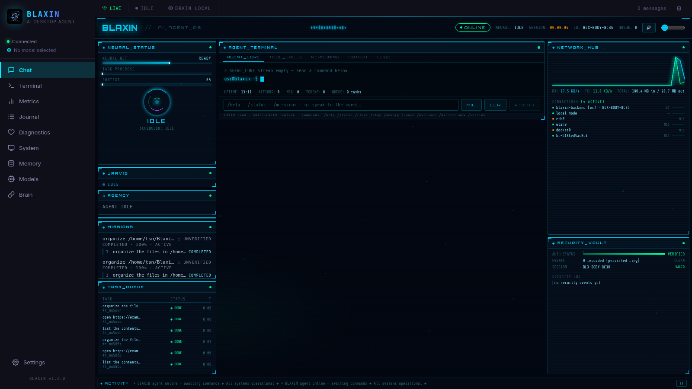
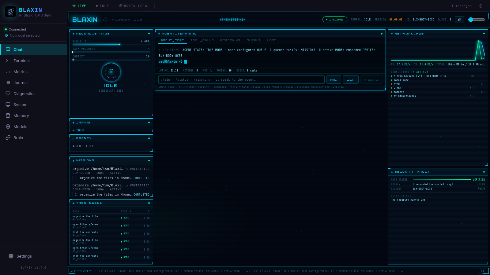
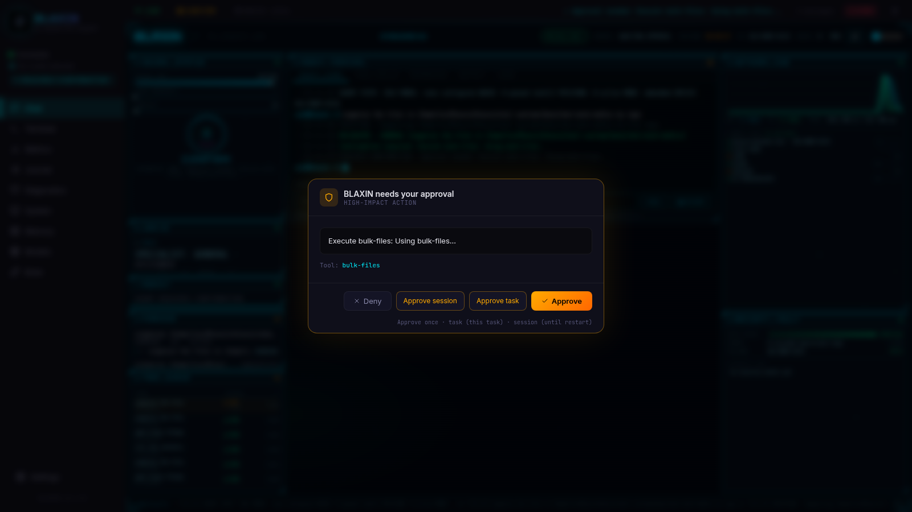
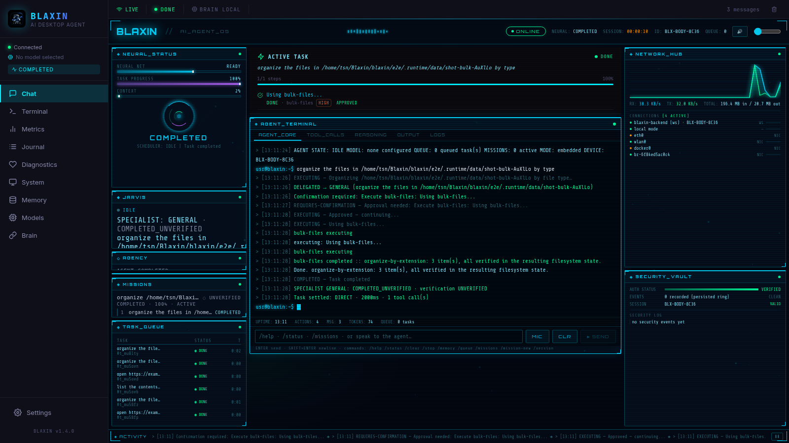

<p align="center">
  
</p>

<h1 align="center">BLAXIN</h1>

<p align="center">
  <strong>An open-source AI desktop agent for Linux — it plans multi-step tasks and actually does them on your computer.</strong>
</p>

<p align="center">
  <a href="https://github.com/tasinxxx/Blaxin/releases"></a>
  <a href="https://github.com/tasinxxx/Blaxin/actions/workflows/e2e.yml"></a>
  <a href="https://github.com/tasinxxx/Blaxin/pkgs/container/blaxin%2Fserver"></a>
  
  <a href="LICENSE"></a>
</p>

<p align="center">
  <a href="https://github.com/tasinxxx/Blaxin/releases">Releases</a> ·
  <a href="#installation">Install</a> ·
  <a href="docs/GETTING_STARTED.md">Getting started</a> ·
  <a href="docs/CAPABILITIES.md">Capabilities</a> ·
  <a href="docs/ARCHITECTURE.md">Architecture</a> ·
  <a href="docs/TROUBLESHOOTING.md">Troubleshooting</a>
</p>

---

## What is BLAXIN?

BLAXIN is a desktop AI agent that takes a plain-language instruction — *"organize my downloads folder"*, *"open example.com"*, *"kill process 4321"* — and carries it out on a real Linux machine: driving the terminal, the file system, the GUI, and the browser through Google Chrome.

Instead of only suggesting commands, BLAXIN plans the steps, executes them through a set of auditable tools, **verifies every outcome against the real environment** (file read-backs, page transitions, process tables, screenshots), and reports honest results — including failures. High-impact actions such as deletions and destructive shell commands pause the agent and require your explicit approval first.

Everything runs locally: the agent, its memory, and — if you choose — the AI model itself (via [Ollama](https://ollama.ai)). Cloud providers are supported but never required.

<p align="center">
  <a href="blaxin/docs/screenshots/hud-main.png"></a>
  <br /><sub>The Jarvis command HUD — a real screenshot of BLAXIN v1.4.0 running on Linux. More below.</sub>
</p>

## Highlights

| | |
|---|---|
| **Verified actions** | Every tool result is checked against reality — filesystem read-back compares, real page-transition verification, fresh process-table re-checks, validated screenshots. `UNKNOWN` never silently becomes success. |
| **Deterministic fast path** | Simple commands ("open example.com", "list /tmp") execute with zero model calls; complex goals escalate to AI reasoning. Every task reports its real route: DETERMINISTIC, AI BRAIN, or HYBRID. |
| **Multi-provider AI** | OpenRouter (first-class), OpenAI, Anthropic, Google, Groq, Together — or fully local with Ollama, including real hardware discovery and a fit-for-your-machine model recommendation. |
| **Jarvis HUD** | A live command-center interface backed by real runtime state: task queue, mission journal, agency workers, network telemetry, security log, memory bank. No simulated UI data. |
| **Safety gates** | Risk-tiered permission system (LOW → CRITICAL) with explicit approval for destructive actions, hard-blocked system/credential paths, AES-256-CBC encrypted credential storage, origin-checked APIs. |
| **Distributed Brain** | Split reasoning ("Brain") from execution ("Body") across devices with authenticated, encrypted pairing — or keep everything embedded on one machine (default). |

## Capabilities

- **Desktop control** — mouse, keyboard, window management via xdotool; screen-bounds grounding; verified screenshots with OCR perception
- **Browser automation** — real Chrome over CDP: navigation, tabs, multi-field form fill with per-field read-back, verified form submission, disk-verified downloads
- **File operations** — read/write with verified read-back, organize-by-type, batch move/copy/rename, and content-hash (SHA-256) duplicate detection and dedupe
- **Process control** — list, inspect, and kill by explicit pid, with zero signals on refusal and kills verified by fresh read-back
- **Missions & specialists** — persistent multi-step missions with per-step checkpoints, bounded specialist agents, deterministic recovery and re-planning
- **Memory & learning** — layered memory (failures / environment / episodes / procedures); verified multi-step runs become reusable procedures, stale ones auto-rollback
- **System control** — real telemetry (CPU/RAM/disk/network/battery), volume control via PipeWire, clipboard, system info
- **Voice** — browser speech recognition and synthesis (feature-detected)

Every capability claim is grounded in the code and test suite — see **[docs/CAPABILITIES.md](docs/CAPABILITIES.md)** for the full detail, including per-capability verification.

## Installation (Linux x86_64)

The one-command installer downloads the latest stable release from GitHub, verifies its SHA-256 checksum, and installs it with desktop integration:

```bash
curl -fsSL https://raw.githubusercontent.com/tasinxxx/Blaxin/main/blaxin/install.sh | bash
```

The installer is distro-aware:

- **Debian / Ubuntu / Kali / Mint** — installs the `.deb` package (runs against your system WebKitGTK — the most reliable configuration)
- **Other distros** — installs the portable AppImage to `/opt/blaxin` with a desktop entry
- Force the AppImage anywhere: `... | bash -s -- --appimage`

<details>
<summary><strong>Manual installation</strong></summary>

Download a package from the [**v1.4.0 release page**](https://github.com/tasinxxx/Blaxin/releases/tag/v1.4.0):

```bash
# .deb (Debian/Ubuntu/Kali)
sudo apt install ./blaxin_1.4.0_amd64.deb
blaxin

# AppImage (portable, other distros)
chmod +x BLAXIN_1.4.0_amd64.AppImage
./BLAXIN_1.4.0_amd64.AppImage
```

On Debian-family systems prefer the `.deb` — see [known AppImage limitation](docs/TROUBLESHOOTING.md#appimage-shows-a-blank-window).

</details>

<details>
<summary><strong>Docker (web deployment)</strong></summary>

A `docker-compose.yml` ships nginx + server + client for self-hosted web deployments:

```bash
cd blaxin
docker compose up -d
```

See [blaxin/docker-compose.yml](blaxin/docker-compose.yml) and the [server Dockerfile](blaxin/server/Dockerfile). Note: a web deployment exposes the agent to network clients — configure `BLAXIN_ALLOWED_ORIGINS` and understand the [security model](SECURITY.md) first.

</details>

<details>
<summary><strong>Run from source (development)</strong></summary>

Requires Node.js 18+:

```bash
git clone https://github.com/tasinxxx/Blaxin.git
cd Blaxin/blaxin
./start.sh          # installs deps, starts backend :3001 + client :5173
```

Then open http://localhost:5173. See [docs/DEVELOPMENT.md](docs/DEVELOPMENT.md) for the full development guide.

</details>

## First launch

1. Start BLAXIN from your application menu, or run `blaxin` in a terminal.
2. The setup wizard walks you through choosing an AI provider:
   - **Cloud** — pick OpenRouter (recommended for model variety), OpenAI, Anthropic, Google, Groq, or Together and paste an API key. Keys are AES-256-CBC encrypted locally and never sent to the UI or logs.
   - **Local** — install [Ollama](https://ollama.ai) (BLAXIN can install and start it for you), pull a model, and BLAXIN recommends the best catalog model that actually fits your CPU/RAM/GPU.
3. Type an instruction in the composer and watch the plan, execution, and verification in real time.

> **No API key yet?** Deterministic commands still work (try `/status` or `list /tmp`) — the full AI reasoning loop needs a provider or local model.

## Basic usage

Natural language goes straight into the composer:

```text
list the contents of /tmp
organize ~/Downloads by type
open https://github.com/tasinxxx/Blaxin/releases
find duplicate files in ~/Pictures
what processes are running
set volume to 40
```

Slash commands: `/help /status /queue /missions /memory /clear /stop /version`

Every high-impact action (deletes, destructive commands, browser/desktop actions) opens an approval dialog before executing — you choose approve-once, approve-for-task, approve-for-session, or deny.

## Architecture

```text
User (Jarvis HUD / voice)
        │
Jarvis Command Layer — deterministic router, slash commands, task queue
        │
Agent Orchestrator (WebSocket) — planning, specialist delegation,
        │                        recovery/re-planning, verification
        │
Provider Abstraction — OpenRouter · OpenAI · Anthropic · Google ·
        │               Groq · Together · Ollama (local) · OCI tunnel
        │
Tools — terminal · filesystem · bulk-files · computer-control ·
        │  process-control · browser (CDP) · blaxin_web · screenshot ·
        │  clipboard · search · system-info · system-audio
        │
Verification-in-depth — read-backs, page transitions, process tables,
        │                 screenshots · evidence recorded in the Mission Journal
        ▼
Your Linux desktop
```

A deeper walkthrough — components, data flow, and the verification/recovery loop — is in **[docs/ARCHITECTURE.md](docs/ARCHITECTURE.md)**.

## Requirements

| | |
|---|---|
| **OS** | Linux x86_64 (Debian/Ubuntu/Kali recommended; AppImage for others) |
| **Display** | X11 recommended; Wayland support is partial (see [limitations](#limitations)) |
| **AI provider** | Any of the supported cloud providers, **or** a local [Ollama](https://ollama.ai) model |
| **RAM / disk** | ~4 GB RAM, ~500 MB disk for the app (model requirements depend on the model you run) |
| **Browser automation** | Google Chrome installed on the system |

## Limitations

Honest limitations of the current release:

- **Linux only, x86_64 only** — no Windows or macOS packages; ARM64 is not supported by the installer
- **Wayland is partial** — desktop control works, but some verification read-backs (e.g. pointer position) are unavailable there and are reported as such rather than guessed
- **AppImage blank-window bug** — the bundled WebKitGTK can fail EGL initialization on some hosts (upstream Tauri issue); use the `.deb` on Debian-family distros. See [troubleshooting](docs/TROUBLESHOOTING.md).
- **Vision-model routing** — screenshot-driven LLM decisions need a vision-capable model; without one, grounding falls back to OCR and the result says so
- **No WhatsApp/cloud-automation integrations** — deliberately out of scope for a privacy-first desktop agent
- **Voice** — browser-based STT/TTS depends on your browser and audio hardware

## Security & safety model

- High-impact actions **pause the agent** and require explicit user approval (once / per-task / per-session scopes)
- Filesystem writes and deletes are **hard-blocked** on system-critical and credential paths (`/etc`, `/boot`, `~/.ssh`, key files, …)
- API keys are **AES-256-CBC encrypted** at rest with `0600` permissions, never logged, never sent to the frontend
- All WebSocket and state-changing HTTP requests are **origin-checked**; the desktop app binds the backend to `127.0.0.1` only
- Secrets are refused by the memory store and masked in all logs

Full detail: **[SECURITY.md](SECURITY.md)**. To report a security vulnerability, please follow the [responsible disclosure policy](SECURITY.md#reporting-a-vulnerability) — do not open a public issue.

## Project status

**Stable.** BLAXIN **v1.4.0** is the current release and the recommended version for all users. It ships the Jarvis HUD, mission coordination, verified browser/computer/file/process control, and the layered memory system — all backed by a 900+ test suite and real-machine runtime probes recorded in the [release notes](blaxin/update/RELEASE-NOTES-v1.4.0.md).

- **Download**: [v1.4.0 release](https://github.com/tasinxxx/Blaxin/releases/tag/v1.4.0)
- **Updater manifest**: `blaxin/update/latest.json` (signed artifacts)
- **Roadmap**: the project is maintained; bug reports and security reports are welcome via the issue tracker

## Screenshots

All screenshots are real captures of the running application — regenerated with [blaxin/e2e/scripts/capture-screenshots.mjs](blaxin/e2e/scripts/capture-screenshots.mjs).

| | |
|---|---|
| <a href="blaxin/docs/screenshots/hud-agent-terminal.png"></a> | <a href="blaxin/docs/screenshots/confirmation-gate.png"></a> |
| **Agent terminal** — live event stream and slash-command composer | **Confirmation gate** — explicit approval before a high-impact action |
| <a href="blaxin/docs/screenshots/mission-verified.png"></a> | |
| **Verified mission** — a real bulk-files task settled with per-step verification | |

## Documentation

| Document | Contents |
|---|---|
| [docs/GETTING_STARTED.md](docs/GETTING_STARTED.md) | Setup walkthrough: providers, first task, configuration |
| [docs/CAPABILITIES.md](docs/CAPABILITIES.md) | What BLAXIN can do — every claim grounded in code and tests |
| [docs/ARCHITECTURE.md](docs/ARCHITECTURE.md) | Component architecture, data flow, verification & recovery loops |
| [docs/TROUBLESHOOTING.md](docs/TROUBLESHOOTING.md) | Common problems: AppImage/WebKitGTK, Wayland, providers, Ollama |
| [docs/DEVELOPMENT.md](docs/DEVELOPMENT.md) | Repository layout, running from source, tests and probes |
| [blaxin/README.md](blaxin/README.md) | Full user guide: features, tools, provider setup, env variables |
| [blaxin/docs/models.md](blaxin/docs/models.md) | Local model system: hardware inventory, catalog, recommendation |
| [blaxin/docs/distributed-brain.md](blaxin/docs/distributed-brain.md) | Brain/Body architecture, pairing, protocol, Multi-Body |
| [blaxin/docs/oci.md](blaxin/docs/oci.md) | Oracle Cloud inference: security model, provisioning, tunnels |
| [blaxin/docs/capability-matrix.md](blaxin/docs/capability-matrix.md) | Detailed capability audit with per-claim verification evidence |

## Contributing

Contributions are welcome — bug reports, documentation improvements, and code. See **[CONTRIBUTING.md](CONTRIBUTING.md)** for the workflow and project conventions.

## Reporting issues

- **Bug report** → [open an issue](https://github.com/tasinxxx/Blaxin/issues/new?template=bug_report.yml) (the journal excerpt from the Mission Journal page makes bugs much easier to diagnose)
- **Feature idea** → [feature request](https://github.com/tasinxxx/Blaxin/issues/new?template=feature_request.yml)
- **Security vulnerability** → [SECURITY.md](SECURITY.md#reporting-a-vulnerability) (private disclosure, please)

## License

BLAXIN is released under the [MIT License](LICENSE).
