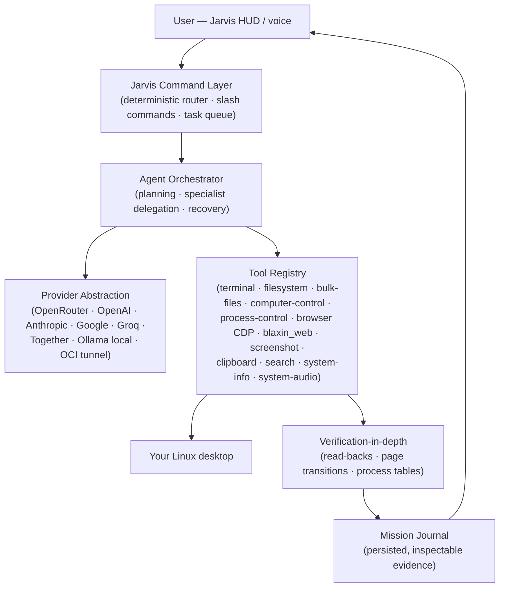
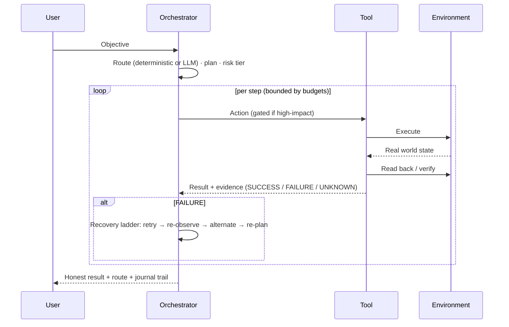

# BLAXIN Architecture

This document describes how BLAXIN v1.4.0 actually works — every component named here exists in the source tree, with its location cited. No aspirational components are described as real.

## Overview

BLAXIN is a local-first desktop agent: a React HUD talks over WebSocket/HTTP to a Node.js orchestrator, which plans tasks, executes them through a registry of verified tools against the Linux desktop, and reports honest results.

Source locations: `blaxin/client/src` (HUD), `blaxin/server/src/router` (command layer), `blaxin/server/src/orchestrator` (agent), `blaxin/server/src/providers` (models), `blaxin/server/src/tools` (tools), `blaxin/server/src/utils` (missions, journal, permissions, telemetry).

## Component walkthrough

### 1. Jarvis HUD (client)

React 18 + Vite + Zustand (`blaxin/client/src`). The HUD is the approved command-center layout: boot overlay, neural status, task queue, agent terminal, network hub, security vault, agency panel, memory bank, mission panel, activity ticker. Every panel renders real runtime state delivered over WebSocket snapshots — there is no simulated UI data.

- **Deterministic router first**: simple commands ("open example.com", "list /tmp", browser back/forward/refresh, slash commands like `/status`) execute with zero model calls. Complex or ambiguous goals escalate to the LLM loop.
- **Live regions**: agent-state transitions are announced through real `role=status` regions; the terminal shows the live event stream (plan → action → observation → result).

### 2. Orchestrator (server)

`blaxin/server/src/orchestrator/index.ts` — the agent loop:

1. **Understand** the objective; classify risk via `utils/permission.ts` (LOW → CRITICAL tiers).
2. **Plan** steps (with layered-memory context from `memory/advisor.ts` — the current instruction always outranks memory).
3. **Execute** steps through tools, serially or in waves. The first real tool activation claims a bounded **specialist objective** (`orchestrator/specialist.ts`) with action/recovery/replan budgets and a deadline.
4. **Observe & verify** each result (see below). Verification is tri-state: SUCCESS / FAILURE / UNKNOWN — and UNKNOWN never upgrades to success.
5. **Recover** on failure through a deterministic ladder (`orchestrator/recovery-policy.ts`): retry/backoff → re-observe → alternate path → one re-plan → escalate to the model only after the budget is exhausted.
6. **Settle** the task: real result, real route label (DETERMINISTIC / AI BRAIN / HYBRID), memory episode recorded, verified multi-step runs may be promoted to reusable procedures.

### 3. Mission & task subsystems

- **Task queue** (`utils/task-queue.ts`): persistent, priority-ordered, dependency-gated; survives restarts.
- **Missions** (`utils/missions.ts`): multi-step persistent missions with per-step checkpoints — pause and resume from the last completed checkpoint, retry only failed steps.
- **Scheduler** (`utils/scheduler.ts`): feeds queued tasks and mission steps to the orchestrator and settles them from real agent-state events.
- **Mission coordination** (`orchestrator/mission-coordinator.ts`): binds real specialist evidence to mission steps; `{{evidence:stepId}}` templates resolve only from verified evidence; mission-level verification aggregates from per-step evidence; cancelling a mission cancels its tasks.

### 4. Providers

`blaxin/server/src/providers/*` — a uniform abstraction over OpenRouter (first-class), OpenAI, Anthropic, Google, Groq, and Together, plus:

- **Ollama (local)** — local daemon on loopback; the Models page performs real hardware discovery (CPU/RAM/GPU/VRAM/disk) and recommends catalog models that actually fit, with truthful runtime status.
- **Adaptive routing** — capability-aware model selection from real provider data (e.g. `/api/tags`), bounded reliability demotion, and an honest BLOCK when no model fits the task.
- **Oracle Cloud (optional)** — provision a cloud inference node whose endpoint reaches the Brain over a loopback SSH tunnel, never a public port (`docs/oci.md` in `blaxin/docs/`).

### 5. Tools

`blaxin/server/src/tools/*` — each tool is registered with a risk tier and, for high-impact verbs, a confirmation requirement. Highlights:

| Tool | What it does | Verification |
|---|---|---|
| `terminal` | Shell commands with timeout protection | Real exit codes — nonzero exit is a failure even with stdout |
| `filesystem` | Read/write/create/delete/rename | Writes verified by read-back compare; system/credential paths hard-blocked |
| `bulk-files` | Organize, batch move/copy/delete, rename, SHA-256 dedupe | Delete-verified from the filesystem; deterministic keeper; bounded scans |
| `computer-control` | Mouse, keyboard, windows (xdotool) | Pointer read-back ±2px; screen-bounds grounding refuses off-screen input |
| `process-control` | List / inspect / kill by explicit pid | Kill SUCCESS only when a fresh read-back shows the process gone; protected pids refused with zero signals |
| `browser` / `blaxin_web` | Real Chrome over CDP: navigation, tabs, forms, downloads | Page-transition verification; per-field form read-backs; disk-verified downloads |
| `screenshot` | Screen capture | Validates the capture is a real PNG; carried to vision-capable models |
| `system-audio` | Volume get/set/mute (PipeWire) | get→set→get read-back verification |
| `clipboard`, `search`, `system-info` | Clipboard, web search, telemetry | Clipboard writes verified by read-back |

### 6. Verification-in-depth

Verification is a first-class subsystem (`tools/verification.ts` and per-tool read-backs), not a label:

- **Browser**: actions verify against the real page — URL/title/text/element/playback; back/forward verify the real CDP history index AND the landing URL; refresh verifies the document was really replaced.
- **Filesystem**: every write is proven by read-back compare; deletes are proven by absence.
- **Processes**: kills are proven by a fresh process-table read, never by "signal sent".
- **Honesty rule**: where verification is impossible (e.g. Wayland pointer position), the result says so explicitly instead of implying success.

### 7. Evidence: the Mission Journal

`utils/mission-journal.ts` — a bounded, persisted record of what the system actually did: the command, routing decision, plan, each action keyed by its real runtime step id (intended vs actual), the observation, the real verification method/result, bounded recovery with the true retry count, and the final result with its execution mode. Served over `GET /api/journal` and live over WebSocket. Nothing is recorded that did not really happen.

### 8. Memory

`blaxin/server/src/memory/*` — layered stores (failure / environment / episodic / procedural) with secret redaction and honest degradation. At task end the orchestrator records one bounded episode, failure lessons from real failed tool steps, and environment observations only when browser verification produced real URL evidence. Verified multi-step runs promote reusable procedures; advisor-selected procedures that keep failing lose confidence and auto-rollback. Inspectable via the Memory page and `GET /api/memory/layers`.

### 9. Distributed Brain (optional)

Default mode is `embedded` — the local orchestrator acts as the Brain in-process. With `BLAXIN_BRAIN_MODE=external`, this device becomes a **Body** that pairs with a separate **Brain** process (another laptop, VM or server) over an authenticated, encrypted WebSocket: Ed25519 device identities, one-time pairing codes, challenge/response auth, capability exchange, reconnect with backoff. The Brain reasons and sends structured action requests; the Body validates (and confirms with the user where required) before executing. One Brain can serve many Bodies. Full detail: [blaxin/docs/distributed-brain.md](../blaxin/docs/distributed-brain.md).

## The verification & recovery loop

## What is deliberately NOT in this architecture

Documented non-goals of the current release (kept honest rather than half-implemented):

- No messaging-platform integrations (e.g. WhatsApp automation)
- No decorative "world monitor" widgets that pretend to show data BLAXIN does not really have
- No fabricated benchmarks or simulated UI state — HUD values come from real telemetry and real events only

## Further reading

- [CAPABILITIES.md](CAPABILITIES.md) — per-capability detail and verification
- [blaxin/docs/capability-matrix.md](../blaxin/docs/capability-matrix.md) — the full audit matrix with per-claim test evidence
- [blaxin/docs/distributed-brain.md](../blaxin/docs/distributed-brain.md) — Brain/Body protocol and pairing
- [blaxin/docs/models.md](../blaxin/docs/models.md) — local model system internals
